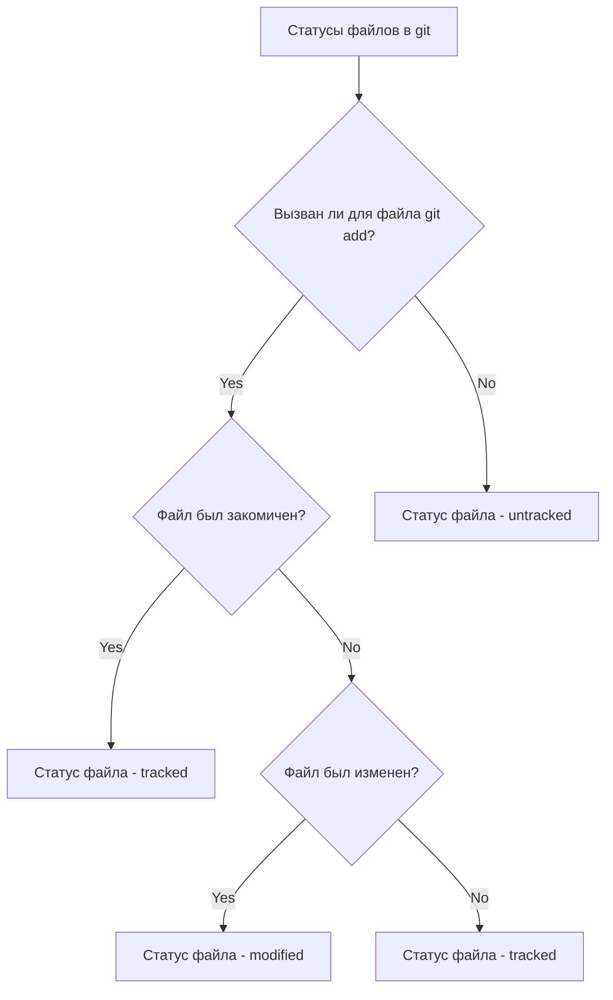

# Шпаргалка git

## Соединение git & github
git remote add origin _ref_

git remote -v

git push -u origin master

git push

## Хэши
Хэш - это зашифрованная информация о коммите (дата, автор, содержание)

## Логи
Логи позволяют читать информацию о каждом коммите (дата, автор, содержание, хэш)

## HEAD
HEAD - специальный служебный файл, который содержит хэш последнего коммита

## Статусы файлов
**untracked** - файл, который git видит, но не сохраняет его изменения
**staged** - файл, после выполнения _git add_
**tracked** - файл, который либо закомичен, либо добавлен _git add_, либо изменен
**modified** - файл, который был изменен после последнего _git add_ or _git commit_

**staged -- tracked**

**modified + git add = tracked**

**commited = tracked**

## Оформление коммита
### Можно использовать оформление Conventional Commits
1. *type : сообщение*
2. Размер - 30-72 символа

## Изменение коммита
git commit --amend --no-edit

git commit --amend -m "asda"

- Данные команды изменяют последний коммит

git restore --staged _file_

- убрать файл из staged
